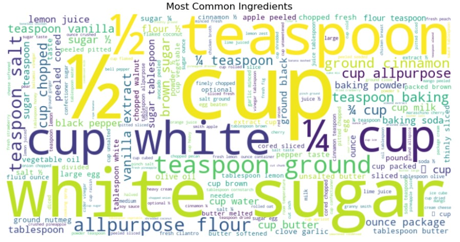

# 🍳 Recipe Recommender System

A machine learning-powered recipe recommendation system that suggests personalized recipes based on available ingredients. The system uses Support Vector Machines (SVM) and Naive Bayes algorithms to provide accurate recipe suggestions along with detailed cooking instructions.



## ✨ Features

- **Intelligent Recipe Matching**: Uses advanced ML algorithms (SVM & Naive Bayes) to match ingredients with suitable recipes
- **Natural Language Processing**: Implements text preprocessing including lemmatization and stop word removal
- **Cross-Validation**: Employs K-Fold cross-validation for robust model evaluation
- **Interactive Interface**: User-friendly command-line interface for ingredient input
- **Visual Analytics**: 
  - Word cloud visualization of common ingredients
  - Confusion matrix heatmap for model performance analysis
  - Recipe distribution insights

## 🚀 Getting Started

### Prerequisites

```bash
python>=3.8
pandas
numpy
scikit-learn
matplotlib
seaborn
wordcloud
nltk
```

### Dataset Setup

Place your dataset files in the project directory:
- `recipes.csv`: Training dataset
- `test_recipes.csv`: Testing dataset

Dataset format requirements:
- Training data columns: 'recipe_name', 'ingredients', 'directions'
- Test data columns: 'Name', 'Ingredients', 'Directions'

## 🛠️ Technical Details

### Model Architecture
- **Feature Extraction**: TF-IDF Vectorization (max_features=5000)
- **Models**:
  - SVM with linear kernel
  - Multinomial Naive Bayes
- **Hyperparameter Tuning**: Grid Search CV for SVM
- **Similarity Metric**: Cosine Similarity

### Text Preprocessing Pipeline
1. Case normalization
2. Number removal
3. Special character removal
4. Lemmatization
5. Stop word removal

## 📊 Performance Metrics

The system's performance is evaluated using:
- Confusion Matrix
- Classification Report
- Cross-validation Scores

## 🤝 Contributing

1. Fork the repository
2. Create your feature branch (`git checkout -b feature/AmazingFeature`)
3. Commit your changes (`git commit -m 'Add some AmazingFeature'`)
4. Push to the branch (`git push origin feature/AmazingFeature`)
5. Open a Pull Request

---------------------------------------------------------------------------
⭐️ If you found this project helpful, please give it a star!
